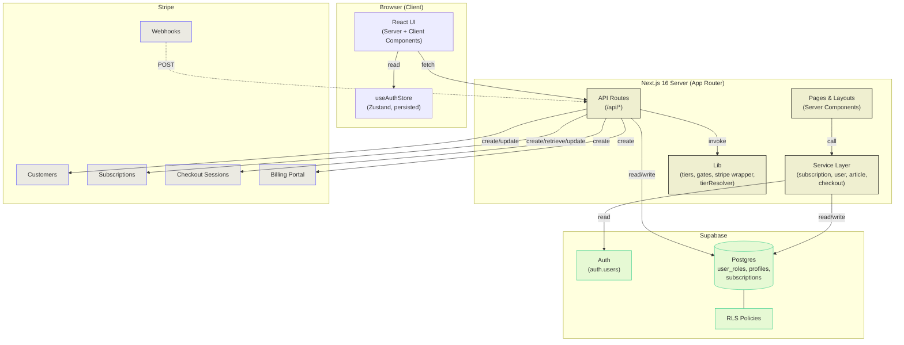

# ARCHITECTURE

> **Project:** StarkReads (`nextjs16-supabase-stripe-subscription-2026-v1`)
> **Phase:** 2 (Backend Integration) — complete
> **Last reviewed:** 2026-05-03

---

## Table of Contents

1. [System Overview](#1-system-overview)
2. [The Three-System Model](#2-the-three-system-model-rbac--subscriptions--auth)
3. [High-Level Architecture Diagram](#3-high-level-architecture-diagram)
4. [Data Flows](#4-data-flows)
5. [The "Stripe Owns Truth, Supabase Owns Cache" Pattern](#5-the-stripe-owns-truth-supabase-owns-cache-pattern)
6. [Technology Stack](#6-technology-stack)
7. [The Service-Layer Swap Pattern (Phase 1 → Phase 2)](#7-the-service-layer-swap-pattern-phase-1--phase-2)
8. [Server / Client Boundary](#8-server--client-boundary)
9. [Environment Variable Architecture](#9-environment-variable-architecture)

---

## 1. System Overview

StarkReads is a **subscription-gated content platform** built on Next.js 16 (App Router), Supabase (Auth + Postgres), and Stripe (Subscriptions + Customer Portal).

The system has three orthogonal authorization concerns:

| Concern | Question it answers | Source of truth |
|---------|---------------------|-----------------|
| **Auth** (identity) | "Who is this user?" | `auth.users` (Supabase Auth) |
| **RBAC** (role) | "What is this user allowed to do?" | `public.user_roles` (Supabase) |
| **Tier** (subscription) | "What content can this user see?" | `stripe.subscriptions` (Stripe) → cached in `public.subscriptions` (Supabase) |

These three systems are **independent**. A user can be authenticated but have no role record (impossible — the trigger fixes this), or have an `admin` role but a `free` subscription tier (perfectly valid — admins read free content unless they pay). The combinations are managed separately.

**Why this matters:** entitlements (what content) and authorization (what actions) are decoupled. An admin doesn't get free Pro content because they're an admin; they get it only if their `subscriptions.tier ≥ pro`.

---

## 2. The Three-System Model: RBAC + Subscriptions + Auth

```
┌─────────────────────────────────────────────────────────────────────┐
│                           USER REQUEST                              │
│                              │                                      │
│                              ▼                                      │
│                    ┌──────────────────┐                             │
│                    │   AUTH (identity)│   "Who are you?"            │
│                    │  Supabase Auth   │   → returns user.id, email  │
│                    └─────────┬────────┘                             │
│                              │                                      │
│           ┌──────────────────┴──────────────────┐                  │
│           ▼                                     ▼                  │
│   ┌──────────────┐                       ┌──────────────────┐     │
│   │ RBAC (role)  │                       │  TIER (sub)      │     │
│   │ user_roles   │  "What can you DO?"   │  subscriptions   │     │
│   │              │                       │                  │     │
│   │ superadmin / │                       │  free / starter /│     │
│   │ admin /      │                       │  pro / enterprise│     │
│   │ member       │                       │                  │     │
│   └──────┬───────┘                       └────────┬─────────┘     │
│          │                                        │                │
│          ▼                                        ▼                │
│  Gates admin/superadmin                  Gates premium content    │
│  portal pages + actions                  pages (starter, pro,      │
│  via getUserRole() + role                enterprise) via           │
│  checks in layouts/actions               requireSubscriptionTier() │
└─────────────────────────────────────────────────────────────────────┘
```

### File mapping for each system

**Auth (identity):**
- `src/utils/supabase/server.ts` — server client (RLS-aware, cookie-based session)
- `src/utils/supabase/admin.ts` — service-role client (bypasses RLS)
- `src/utils/supabase/client.ts` — browser client (anon key)
- `src/utils/supabase/middleware.ts` — cookie session refresh
- `src/app/api/auth/login/route.ts`, `signup/route.ts`, `logout/route.ts`, `confirm/route.ts` — auth endpoints
- `src/store/useAuthStore.ts` — client-side auth state (Zustand, persisted)

**RBAC (role):**
- `supabase/setup.sql` — defines `app_role` enum + `user_roles` table + `handle_new_user()` trigger
- `src/utils/get-user-role.ts` — `getUserRole(userId)` — fetches canonical role
- `src/app/(admin)/layout.tsx`, `src/app/(superadmin)/layout.tsx` — role-gated layouts
- `src/app/(admin)/admin-portal/actions.ts`, `src/app/(superadmin)/superadmin-portal/actions.ts` — server actions that re-check role server-side
- `src/app/api/auth/superadmin-add-user/route.ts` — superadmin-only API

**Tier (subscription):**
- `src/types/subscription.ts` — `SubscriptionTier`, `TIER_LEVELS`, `Subscription`, `Plan`
- `src/lib/tiers.ts` — `meetsTier()`, `tierDisplayName()`
- `src/lib/auth/requireSubscriptionTier.ts` — server-side gate helper
- `src/services/subscriptionService.ts` — `getCurrentSubscription()` (server-only, queries Supabase)
- `src/services/checkoutService.ts` — `subscribe(tier)` (client-safe, hits `/api/checkout`)
- `src/app/api/checkout/route.ts`, `customer-portal/route.ts`, `webhooks/stripe/route.ts` — Stripe integration

---

## 3. High-Level Architecture Diagram



---

## 4. Data Flows

### 4.1 New Subscriber Flow (first-time purchase)

```
User on /pricing
   │
   │ clicks "Subscribe to Pro"
   ▼
PlanCard.tsx → checkoutService.subscribe('pro')
   │
   │ POST /api/checkout  { tier: "pro" }
   ▼
src/app/api/checkout/route.ts
   │
   ├─→ Auth: createClient().auth.getUser()                [Supabase user client]
   │
   ├─→ Validate tier ∈ {starter, pro, enterprise}
   │
   ├─→ Lookup subscriptions row WHERE user_id = X         [Supabase admin client]
   │   → no row found → user is brand new
   │
   ├─→ stripe.customers.create({ email, metadata })       [Stripe]
   │   → returns cus_xxx
   │
   ├─→ supabaseAdmin.from('subscriptions').upsert({       [Supabase admin client]
   │     user_id, stripe_customer_id, tier,
   │     status: 'incomplete'
   │   })
   │
   └─→ stripe.checkout.sessions.create({                  [Stripe]
         mode: 'subscription',
         customer: cus_xxx,
         line_items: [{ price: priceId, quantity: 1 }],
         success_url: <origin>/subscribe/success,
         cancel_url:  <origin>/pricing
       })
       → returns { url: "https://checkout.stripe.com/..." }

Response: { redirect_url: "https://checkout.stripe.com/..." }
   │
   ▼
Browser → window.location.href = redirect_url

   ──────── User completes payment on Stripe-hosted page ────────

Stripe → POST /api/webhooks/stripe   (event: checkout.session.completed)
   │
   ▼
src/app/api/webhooks/stripe/route.ts (see § 4.3)

   ──────── Stripe → 302 redirect → /subscribe/success ────────

src/app/(members)/subscribe/success/SubscribeSuccessContent.tsx
   │
   │ polls subscriptionService.getCurrentSubscription()
   │ until tier !== 'free' (handles webhook race window)
   │
   ▼
Renders "Welcome to Pro" → user navigates to /members-portal
```

### 4.2 Tier Upgrade Flow (existing active sub → higher tier)

This is the path that **does NOT create a new Stripe Subscription** — it modifies the existing one. Fixed in 2026-04-29 (was creating duplicate Stripe subscriptions before).

```
User with active Starter subscription clicks "Upgrade to Pro"
   │
   │ POST /api/checkout  { tier: "pro" }
   ▼
src/app/api/checkout/route.ts
   │
   ├─→ Auth + tier validation (same as new flow)
   │
   ├─→ Lookup subscriptions row WHERE user_id = X
   │   → row found with stripe_subscription_id = sub_xxx, status = 'active'
   │
   ├─→ stripe.subscriptions.retrieve(sub_xxx)             [Stripe]
   │   → returns subscription object with items.data[0].id (the SubscriptionItem ID)
   │
   ├─→ stripe.subscriptions.update(sub_xxx, {             [Stripe]
   │     items: [{ id: itemId, price: newPriceId }]
   │   })
   │   → swaps the price; Stripe handles proration
   │
   └─→ Skip Checkout Session entirely.
       Build internal redirect URL: <origin>/subscribe/success

Response: { redirect_url: "<origin>/subscribe/success" }
   │
   ▼
Browser → window.location.href = redirect_url
   │
   ▼
Stripe → POST /api/webhooks/stripe (event: customer.subscription.updated)
   │
   ▼
Webhook handler updates subscriptions row → tier: 'pro', status, period dates
```

### 4.3 Webhook Processing Flow

```
Stripe POST /api/webhooks/stripe
   │
   │ headers: { 'stripe-signature': 't=...,v1=...' }
   │ body: <raw bytes>
   ▼
src/app/api/webhooks/stripe/route.ts
   │
   ├─→ const body = await request.text()                  ← raw, NOT request.json()
   ├─→ const signature = request.headers.get('stripe-signature')
   │   → if missing → 400
   │
   ├─→ stripe.webhooks.constructEvent(body, signature,
   │     process.env.STRIPE_WEBHOOK_SECRET)
   │   → if signature invalid → 400
   │   → on success → returns typed Stripe.Event
   │
   ├─→ switch(event.type) {
   │
   │     case 'checkout.session.completed':
   │       1. session.subscription → subscriptionId
   │       2. stripe.subscriptions.retrieve(subscriptionId)
   │       3. firstItem = subscription.items.data[0]
   │       4. tier = resolveTierFromPriceId(firstItem.price.id)
   │       5. supabaseAdmin.from('subscriptions').upsert({
   │            user_id, stripe_customer_id, stripe_subscription_id,
   │            tier, status: subscription.status,
   │            current_period_start: ISO from firstItem.current_period_start,
   │            current_period_end:   ISO from firstItem.current_period_end,
   │            cancel_at_period_end
   │          }, { onConflict: 'user_id' })
   │
   │     case 'customer.subscription.updated':
   │       1. subscription = event.data.object
   │       2. tier = resolveTierFromPriceId(firstItem.price.id)
   │       3. UPDATE subscriptions SET tier, status, period dates
   │          WHERE stripe_subscription_id = subscription.id
   │
   │     case 'customer.subscription.deleted':
   │       1. UPDATE subscriptions SET status = 'canceled'
   │          WHERE stripe_subscription_id = subscription.id
   │
   │     default:
   │       console.log('[webhook] Unhandled event type:', event.type)
   │   }
   │
   └─→ return 200 ALWAYS (even on per-event errors — see § 5 below)
```

### 4.4 Content Gating Flow (server-side)

```
User navigates to /members-portal/pro
   │
   ▼
src/app/(members)/members-portal/pro/page.tsx
   │
   │ const user = await requireSubscriptionTier('pro', '/members-portal/pro')
   ▼
src/lib/auth/requireSubscriptionTier.ts
   │
   ├─→ const user = await userService.getCurrentUser()
   │
   ├─→ src/services/userService.ts
   │   ├─→ supabase.auth.getUser()                        [Supabase user client + cookie session]
   │   │   → if null → return null
   │   ├─→ getUserRole(user.id)                           [user_roles table]
   │   └─→ subscriptionService.getCurrentSubscription()   [subscriptions table]
   │       → returns Subscription (or { tier: 'free', status: 'none' } default)
   │
   ├─→ if (!user) → redirect('/auth?next=/members-portal/pro')
   │
   ├─→ if (!meetsTier(user.subscription.tier, 'pro')) →
   │     redirect('/pricing?next=/members-portal/pro')
   │
   └─→ return user (page renders normally)
```

---

## 5. The "Stripe Owns Truth, Supabase Owns Cache" Pattern

```
            ┌────────────────────────────────────────┐
            │      STRIPE (source of truth)          │
            │   Customers, Subscriptions, Prices,    │
            │   Invoices, Payment Methods, Events    │
            └───────────────┬────────────────────────┘
                            │
                            │ Webhooks (push)
                            ▼
            ┌────────────────────────────────────────┐
            │   /api/webhooks/stripe                 │
            │   - Verifies signature                 │
            │   - Maps event → DB write              │
            │   - Returns 200 (always)               │
            └───────────────┬────────────────────────┘
                            │
                            │ UPSERT/UPDATE
                            ▼
            ┌────────────────────────────────────────┐
            │   SUPABASE.subscriptions (cache)       │
            │   - One row per user                   │
            │   - tier, status, period dates,        │
            │     stripe_customer_id,                │
            │     stripe_subscription_id             │
            └───────────────┬────────────────────────┘
                            │
                            │ Read (low latency, RLS-protected)
                            ▼
            ┌────────────────────────────────────────┐
            │   App reads (gates, dashboards,        │
            │   sub status displays)                 │
            └────────────────────────────────────────┘
```

### Why this pattern

- **Stripe is authoritative** for billing state. It tracks invoice status, payment methods, prorations, retries — things we don't want to reimplement.
- **Supabase is the read-side cache** of the *fields the app cares about* (tier, status, period end). Reading from Supabase is faster, cheaper, and safer than calling Stripe on every page load.
- **Writes always go through Stripe first**, then propagate to Supabase via webhooks. This is why the upgrade flow calls `stripe.subscriptions.update()` and waits for `customer.subscription.updated` to land — it never writes directly to Supabase.
- **Idempotency:** the webhook handler upserts on `user_id`, so duplicate webhook deliveries (which Stripe will sometimes do) converge to the same final state.

### Note on the `onConflict` choice

`DATA_CONTRACT_PHASE2.md` recommended `onConflict: 'stripe_subscription_id'`. The actual implementation in `src/app/api/webhooks/stripe/route.ts` uses `onConflict: 'user_id'`. Functionally similar (both columns are `UNIQUE`), with this practical difference: `user_id` conflict resolution overwrites cleanly when a user cancels and re-subscribes (new `stripe_subscription_id`, same `user_id`). The `user_id` choice is the more forgiving option and is consistent with `subscriptions` having `UNIQUE (user_id)`.

---

## 6. Technology Stack

| Layer | Technology | Why |
|-------|-----------|-----|
| Framework | **Next.js 16** (App Router) | Server Components by default, file-based routing, route groups, built-in API routes |
| Language | **TypeScript 5** | Type safety across full stack; ts-jest in tests |
| Styling | **Tailwind CSS 3.4** + **Sass** | Utility-first; Sass for global styles |
| UI primitives | **ShadCN/UI** (Radix under the hood) | Accessible, composable, headless components |
| State (client) | **Zustand 4** (with `persist`) | Simpler than Redux, persisted auth store via localStorage |
| Forms | **React Hook Form** + **Zod** + `@hookform/resolvers` | Schema-driven validation, minimal re-renders |
| Icons | **Lucide React** + **Heroicons** | Free, consistent, tree-shakable |
| HTML rendering | **html-react-parser** | Safer than `dangerouslySetInnerHTML`; project convention per `CLAUDE.md` |
| Auth | **Supabase Auth** (`@supabase/ssr`, `@supabase/supabase-js`) | Cookie-based sessions for SSR, JWT-based RLS |
| Database | **Supabase Postgres** | RLS, triggers, real-time, generous free tier |
| Payments | **Stripe** (`stripe@22`) | Subscription billing, Customer Portal, hosted Checkout |
| Testing (unit) | **Jest 30** + **ts-jest** | Fast, mature, no Next.js-specific config required |
| Testing (component) | **@testing-library/react** | Accessibility-driven test queries |
| Testing (E2E) | **Playwright 1.59** | Reliable browser automation, parallel workers |
| Theming | **next-themes** | System / light / dark mode toggle |
| Env loading (E2E) | **dotenv** | Playwright runs outside Next.js, needs explicit `.env.local` load |

---

## 7. The Service-Layer Swap Pattern (Phase 1 → Phase 2)

The key architectural win of this project: **the entire UI was built and stable before any backend work**, then real backends were swapped in **without changing a single component**.

### How it works

UI components and pages call **services**, never APIs or Stripe SDKs directly:

```
┌────────────────────────┐    ┌────────────────────────┐
│   UI Component         │    │   Page (Server Comp)   │
│   (e.g. PlanCard)      │    │   (e.g. members        │
│                        │    │    portal page)        │
└──────────┬─────────────┘    └────────┬───────────────┘
           │                           │
           ▼                           ▼
   checkoutService.subscribe()  subscriptionService.getCurrentSubscription()
           │                           │
           └───────────┬───────────────┘
                       │
              [SERVICE INTERFACE — UNCHANGED]
                       │
        ┌──────────────┴──────────────┐
        │                             │
        ▼                             ▼
   Phase 1: cookie/Zustand     Phase 2: Stripe SDK +
   mock implementation         Supabase queries
```

### Service files

| Service | Phase 1 (mock) | Phase 2 (real) |
|---------|----------------|----------------|
| `userService.getCurrentUser()` | Read from dev cookie + Zustand | `auth.getUser()` + `getUserRole()` + `subscriptions` query |
| `subscriptionService.getCurrentSubscription()` | Read from dev cookie | Query `subscriptions` table; default to `{tier:'free', status:'none'}` if no row |
| `subscriptionService.getPlans()` | Return `mockPlans` | Return same hardcoded `PLANS` array (intentionally NOT fetched from Stripe — features/copy live in code) |
| `checkoutService.subscribe(tier)` | Toggle dev cookie/Zustand → return `{redirect_url:'/subscribe/success'}` | POST `/api/checkout` → return `{redirect_url:<stripe url or internal>}` |
| `articleService.*` | Mock array | NO CHANGE — articles are still hardcoded; CMS is out of scope |

### The split: server-only vs client-safe

During the swap, **`subscriptionService` became server-only** (it imports the admin client). Because Turbopack enforces server/client boundaries, calling it from a client component throws at compile time. The fix: extract the network-callable parts into a **separate `checkoutService`** that is client-safe and only does `fetch('/api/checkout')`.

```
Server-only (cannot be imported from "use client" files):
  src/services/userService.ts          ← reads admin DB
  src/services/subscriptionService.ts  ← reads admin DB
  src/lib/stripe/stripe.ts             ← uses STRIPE_SECRET_KEY
  src/lib/stripe/tierResolver.ts       ← reads STRIPE_PRICE_*
  src/lib/auth/requireSubscriptionTier.ts ← calls userService

Client-safe (can be imported from anywhere):
  src/services/checkoutService.ts      ← fetch('/api/checkout')
  src/services/articleService.ts       ← pure data
  src/lib/tiers.ts                     ← pure functions
  src/lib/safeRedirect.ts              ← pure function
  src/types/*                          ← types only
```

### Why this matters

- **Frontend developers can ship UI without waiting for backend** (Phase 1 → 2 in this project)
- **Backend changes don't ripple into components** — only services change
- **Tests are simpler** — services mock cleanly at the import boundary

---

## 8. Server / Client Boundary

Next.js 16 App Router defaults to Server Components. Files only become client-side when:
1. They have `"use client"` at the top, OR
2. They are imported from a `"use client"` file

### What lives where

| File pattern | Server / Client | Why |
|--------------|----------------|-----|
| `app/**/page.tsx` | Server (default) | Pre-render, SEO, can `await` services directly |
| `app/**/layout.tsx` | Server (default) | Auth gates, role checks happen here |
| `app/**/loading.tsx` | Server | Loading skeletons, no interactivity |
| `app/api/**/route.ts` | Server | API endpoints, never client |
| `app/**/*Content.tsx` | **Client** (most) | Interactivity, hooks, browser APIs |
| `app/**/*Form.tsx` | **Client** | Form state via React Hook Form |
| `components/ui/**` | Client (most) | ShadCN primitives use Radix hooks |
| `components/global/Navbar.tsx` | Client | Read auth store, render menu |
| `components/articles/Paywall.tsx` | Client | Conditional CTA buttons, navigation |
| `components/articles/ArticleCard.tsx` | Server | Pure render |
| `lib/**` (pure helpers) | Either | Used in both server and client |
| `services/checkoutService.ts` | Client-safe | Only does `fetch()` |
| `services/userService.ts` | **Server-only** | Imports admin client |
| `services/subscriptionService.ts` | **Server-only** | Imports admin client |
| `utils/supabase/server.ts` | **Server-only** | Uses `cookies()` from `next/headers` |
| `utils/supabase/admin.ts` | **Server-only** | Uses service-role key |
| `utils/supabase/client.ts` | Client | Browser-safe Supabase client |
| `store/**` (Zustand stores) | Client | Use `localStorage`, hooks |
| `types/**` | Either | Types are erased at runtime |

### The Turbopack enforcement

Turbopack (Next.js 16's bundler) **fails the build** if a `"use client"` file imports a server-only module. There is no way to bypass this short of refactoring. This is what surfaced the original `subscriptionService` split — components on the pricing page transitively imported the admin client, and the build broke until `checkoutService` was extracted.

---

## 9. Environment Variable Architecture

### Naming convention

The project uses **generic, vendor-neutral names** in code (`STRIPE_SECRET_KEY`, `SUPABASE_SECRET_KEY`) so that production deployments can map them to project-specific Secret Manager entries without code changes.

### Public vs server-only

Variables prefixed with `NEXT_PUBLIC_` are **inlined into the browser bundle at build time**. Anything else is server-only and never sees the client.

| Variable | Public? | Used by | Notes |
|----------|---------|---------|-------|
| `NEXT_PUBLIC_SUPABASE_URL` | ✅ | All Supabase clients (server, admin, browser) | Shared identifier for the Supabase project |
| `NEXT_PUBLIC_SUPABASE_PUBLISHABLE_KEY` | ✅ | `utils/supabase/server.ts`, `utils/supabase/client.ts` | Anon key — safe to expose, RLS enforces access |
| `NEXT_PUBLIC_STRIPE_PUBLISHABLE_KEY` | ✅ | (Reserved — for client-side Stripe.js if added) | Currently unused in code |
| `NEXT_PUBLIC_SITE_URL` | ✅ | `utils/supabase/server.ts` (cookie security) | `https://...` enables `secure` flag on cookies |
| `NEXT_PUBLIC_API_BASE_URL` | ✅ | `services/postServices.ts` | Base URL for legacy posts API (RBAC starter inheritance) |
| `SUPABASE_SECRET_KEY` | ❌ | `utils/supabase/admin.ts` | Service-role key — bypasses RLS — **server only** |
| `STRIPE_SECRET_KEY` | ❌ | `lib/stripe/stripe.ts` | Stripe secret key — initializes the SDK singleton |
| `STRIPE_WEBHOOK_SECRET` | ❌ | `app/api/webhooks/stripe/route.ts` | Verifies inbound webhook signatures |
| `STRIPE_PRICE_STARTER` | ❌ | `lib/stripe/tierResolver.ts` | Maps to tier `'starter'` |
| `STRIPE_PRICE_PRO` | ❌ | `lib/stripe/tierResolver.ts` | Maps to tier `'pro'` |
| `STRIPE_PRICE_ENTERPRISE` | ❌ | `lib/stripe/tierResolver.ts` | Maps to tier `'enterprise'` |

### Local vs production loading

| Environment | Mechanism |
|-------------|-----------|
| Local dev (`npm run dev`) | Next.js auto-loads `.env.local` |
| Local Jest (`npm test`) | `src/__tests__/jest.setup.ts` sets defaults; real values override if exported in shell |
| Local Playwright (`npm run test:e2e`) | Next.js loads `.env.local` for the dev server; helpers re-load via `dotenv` because they run outside Next |
| Production (Cloud Run) | GCP Secret Manager → environment variables on the Cloud Run service. See `docs/DEPLOYMENT.md`. |

### Generic-name → project-specific Secret Manager mapping

The recommended deployment pattern: in GCP Secret Manager create one secret per env var, give them descriptive names that include project + env (e.g., `starkreads-prod-stripe-secret-key`), then map them to the generic variable names on Cloud Run:

```
Secret Manager name              →  Cloud Run env var name
─────────────────────────────────────────────────────────────
starkreads-prod-stripe-secret-key  →  STRIPE_SECRET_KEY
starkreads-prod-supabase-service   →  SUPABASE_SECRET_KEY
starkreads-prod-stripe-webhook-sec →  STRIPE_WEBHOOK_SECRET
...
```

Code stays portable — same `process.env.STRIPE_SECRET_KEY` works locally and in production.

---

## See Also

- `docs/API_REFERENCE.md` — full request/response shapes for every API route
- `docs/DATABASE_SCHEMA.md` — table definitions, RLS, indexes
- `docs/SUBSCRIPTION_SYSTEM.md` — deep dive on tier mechanics, gates, Stripe object model
- `docs/DEPLOYMENT.md` — production setup, Secret Manager, webhook registration
- `docs/FILE_REFERENCE.md` — every file in `src/` enumerated
- `agent_docs/CURRENT_APP/PHASE_2_BACKEND/` — factory specs (APP_BRIEF, DATA_CONTRACT, FILE_TREE, UI_SPEC) — product source-of-truth
